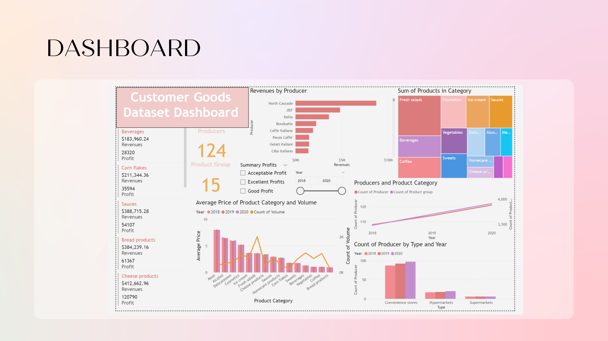
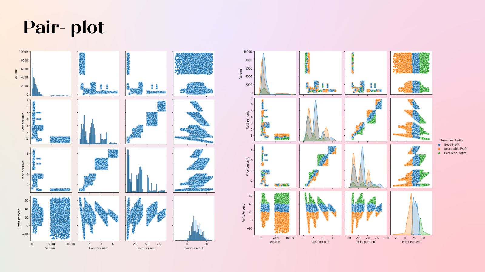
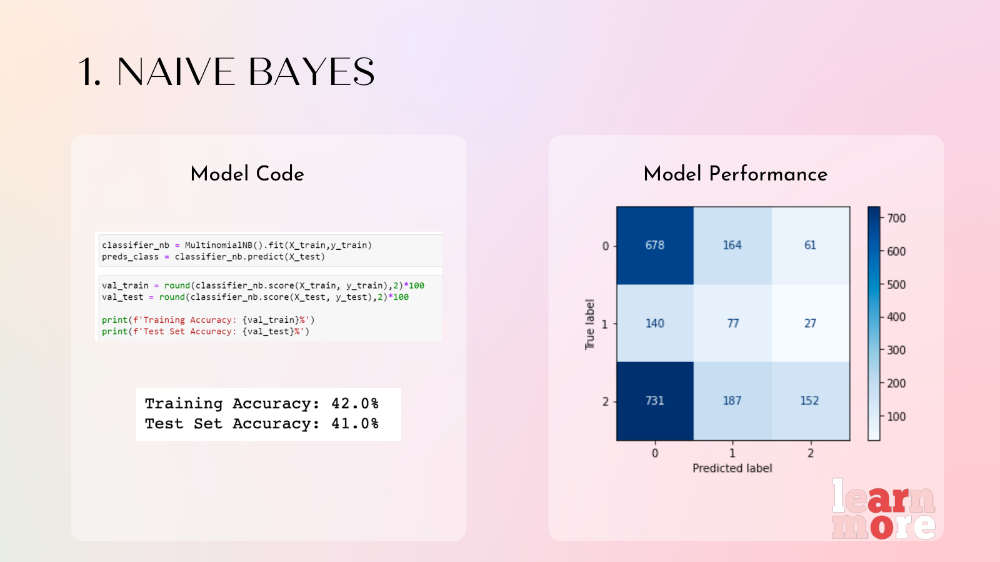
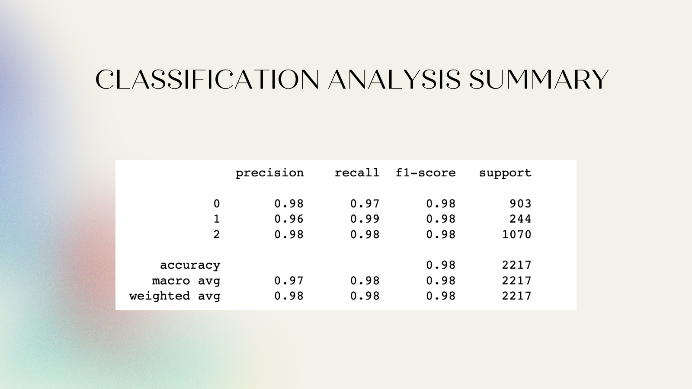

# Consumer Goods ML — Classification & Regression
---
> A ten-model machine learning study on a consumer goods dataset: **five classifiers** and
> **five regressors** benchmarked head-to-head, with leakage detection, GridSearchCV
> hyperparameter tuning, and **XGBoost** topping both tasks (98% accuracy, R² ≈ 1.0).
> Completed as project of the **Big Data & AI Bootcamp**.

## Overview

---
> Given a consumer goods sales dataset (volumes, unit costs, prices, revenues, profits),
this project runs the full supervised learning playbook. After EDA exposed data leakage —
`Revenues` and `Total Cost` trivially determine profit — those features were removed, and
ten models were trained, tuned, and compared on the cleaned feature set to find the most
reliable predictors of product category and profit percentage.

---

> The work is organized as two connected modeling tasks:

| Task | Business Question |
|------|------------------|
| Classification | Can product records be classified into the right category from sales features alone? |
| Regression | How accurately can profit percent be predicted from volume, cost per unit, and price per unit? |

## Technologies Used
---

- Python 3
- Pandas & NumPy
- Scikit-learn (Logistic Regression, Decision Tree, Random Forest, SVM, Naïve Bayes)
- XGBoost (with GridSearchCV tuning)
- Matplotlib, Seaborn & Plotly
- Jupyter Notebook (Google Colab)

## Key Findings
---

- Detected and removed leakage features (`Revenues`, `Total Cost`) before modeling — a key data-quality lesson.
- Classification: XGBoost led with **98% accuracy**, followed by Random Forest at 96%; Naïve Bayes trailed at 41%.
- Regression on profit percent: tree ensembles dominated — Decision Tree and Random Forest both reached **R² = 0.99**, XGBoost **R² ≈ 1.0** (MAE 0.01), versus 0.66–0.68 for SVR and multi-linear regression.
- GridSearchCV tuning confirmed XGBoost's defaults were already near-optimal for this dataset.

## Screenshots
---

### Feature Pairplot

---
### Naïve Bayes Model Performance

---
### Classification Analysis Summary

## Team Members
---
- Eman Alamari
- Maha Alhazzani
- Reema Alaswad
- Raghad Aleisa
- Aljohara Alkanhal
